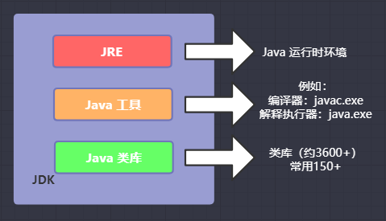

J2SE，标准版的 Java 平台，为用户提供一个程序开发环境。这个程序开发环境提供了开发与运行 Java 软件的编译器等开发工具、软件库及 Java 虚拟机。它也是企业版本和 Java 网页服务的基础。

## 安装配置

[官方下载地址](https://www.oracle.com/technetwork/java/javase/downloads/index.html)

### MacOS

直接下载 `.dmg` 格式的安装包进行安装

```bash
# 查看安装的Java版本
java -version
# 编辑profile文件
sudo vim /etc/profile
# 在打开的 profile 文件中，最下面加入以下文本，添加完成后，保存退出，`jdk1.8.0_191.jdk`路径请自行更改
JAVA_HOME="/Library/Java/JavaVirtualMachines/jdk1.8.0_191.jdk/Contents/Home/"
# 配置CLASS_PATH
CLASS_PATH="$JAVA_HOME/lib"
# 配置PATH
PATH=".:$PATH:$JAVA_HOME/bin"
# 使配置生效
source /etc/profile
# 查看JAVA_HOME是否正确
echo $JAVA_HOME
```

### Linux

> Linux系统官方提供了 `.rpm`, `.gz` 两种格式安装包

```bash
# 1. 下载安装包
#    拷贝安装包到需要安装的服务器
# 2. 解压并安装
#    `.rpm`格式安装(jdk-xxx.rpm 更换成对应的文件名)
sudo rpm -ivh jdk-xxx.rpm
#    `.gz`格式安装(解压到指定目录，常存放`/usr/java/`路径)
tar zxvf jdk-xxx.tar.gz -C /usr/java/
# 3. 设置环境变量
vim /etc/profile
# JAVA_HOME=/usr/java/jdk1.8.0_172 (修改这里路径，指向 jdk 安装路径)
# PATH=$JAVA_HOME/bin:$PATH
# CLASSPATH=.:$JAVA_HOME/lib/dt.jar:$JAVA_HOME/lib/tools.jar
# export JAVA_HOME PATH CLASSPATH
# 4. 编译配置文件，使修改生效
source /etc/profile
# 5. 验证jdk是否安装成功
java –version
```

### Windows

* 下载  
    选择需要的版本,同意协议,并选择对应平台的安装包下载
* 安装  
    下一步,下一步,下一步...完成
* 配置
  * 配置环境变量
  * 验证

## JDK 与 JRE


