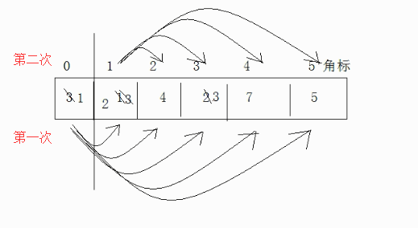
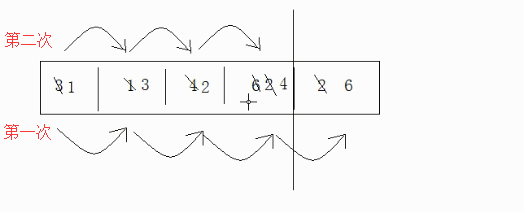

## 数组

**相同类型**数据的集合就叫做数组

## 数组定义

```java
// 一维数组
// type[] 变量名 = new type(数组中元素的个数)
int[] a = new int[10];

// 二维数组（本质是数组的数组）
// 定义一个 10 行，4 列的二维数组
int[][] b = new int[10][4];
```

>* 数组的元素索引是从 0 开始
* 数组的最大索引==数组的长度-1
* 数组的长度一旦确定，就**不能修改**

## 排序

### 选择排序

性能比较低



```java
public static void selectSort(int[] arr){
     for(int x = 0; x < arr.length-1; x++){
          for(int y = 0; y < arr.length; y++){
               if(arr[x] > arr[y]){
                    int temp = arr[x];
                    arr[x] = arr[y];
                    arr[y] = temp;
               }
          }
     }
}

```

### 冒泡排序

相邻的两元素进行比较，如果符合条件换位



```java
public static void bubbleSort(int[] arr){
     for(int x = 0; x < arr.length-1; x++){
         // -x:让每一次比较的元素减少，-1：避免角标越界
          for(int y = 0; y < arr.length-x-1; y++){
               if(arr[y] > arr[y+1]){
                    int temp = arr[y];
                    arr[y] = arr[y+1];
                    arr[y+1] = temp;
               }
          }
     }
}

```

### 二分查找

* 待查找数组必须是有序