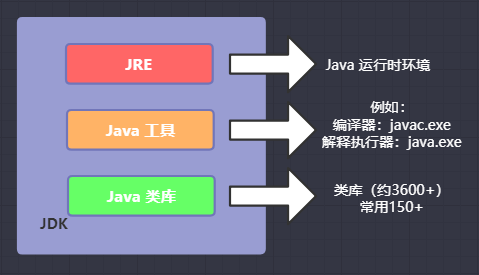

# Java SE 入门

J2SE，标准版的Java平台，为用户提供一个程序开发环境。这个程序开发环境提供了开发与运行Java软件的编译器等开发工具、软件库及Java虚拟机。它也是企业版本和Java网页服务的基础。

> Java SE 相关示例代码请查看 [rc-cluster-jdk](https://github.com/RootCluster/rc-cluster-jdk) 项目

# 安装配置

[官方下载地址](https://www.oracle.com/technetwork/java/javase/downloads/index.html)

## MacOS

## Linux
> Linux系统官方提供了.rpm,.gz两种格式安装包

```bash
# 1.下载安装包
#    拷贝安装包到需要安装的服务器
# 2.解压并安装
#    `.rpm`格式安装(jdk-xxx.rpm更换成对应的文件名)
sudo rpm -ivh jdk-xxx.rpm
#    `.gz`格式安装(解压到指定目录，常存放`/usr/java/`路径)
tar zxvf jdk-xxx.tar.gz -C /usr/java/
# 3.设置环境变量
vim /etc/profile
# JAVA_HOME=/usr/java/jdk1.8.0_172 (修改这里路径，指向jdk安装路径)
# PATH=$JAVA_HOME/bin:$PATH
# CLASSPATH=.:$JAVA_HOME/lib/dt.jar:$JAVA_HOME/lib/tools.jar
# export JAVA_HOME PATH CLASSPATH
# 4.编译配置文件，使修改生效
source /etc/profile
# 5.验证jdk是否安装成功
java –version
```

## Windows

* 下载  
    选择需要的版本,同意协议,并选择对应平台的安装包下载
* 安装  
    下一步,下一步,下一步...完成
* 配置
    * 配置环境变量

    * 验证

# JDK 与 JRE

